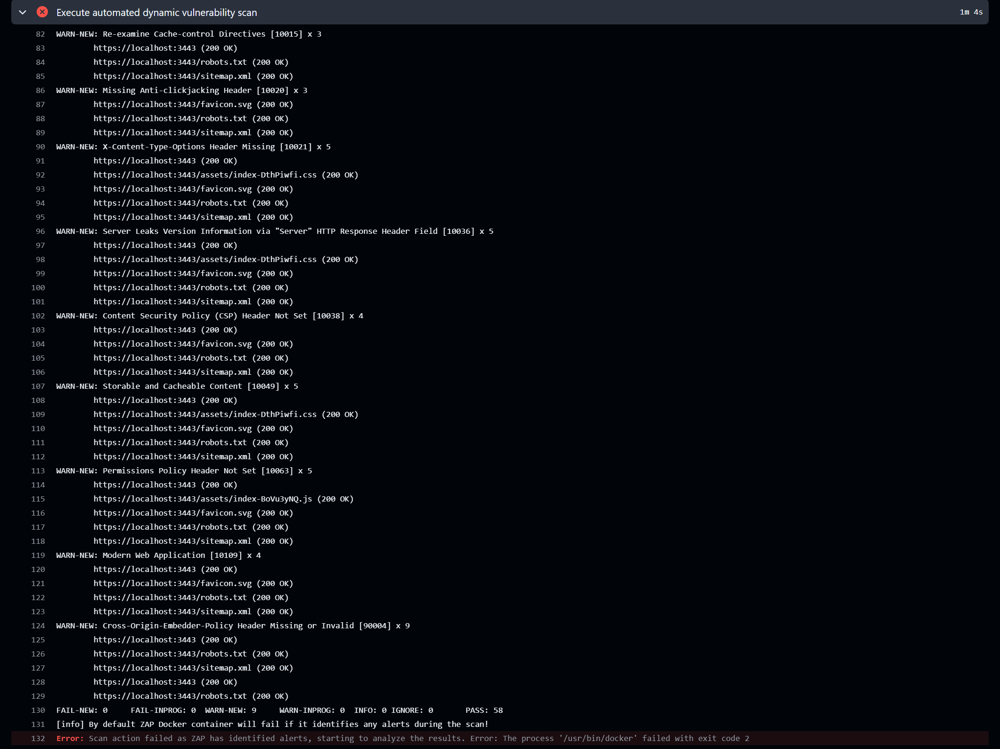
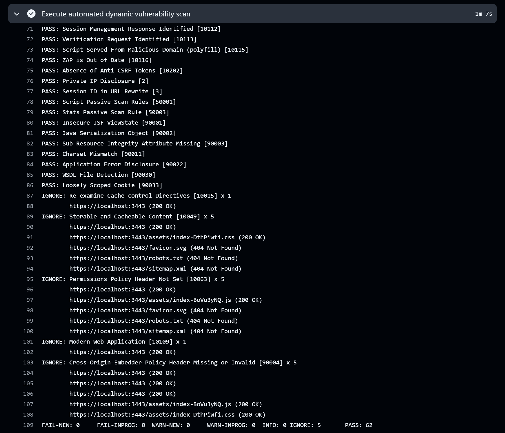
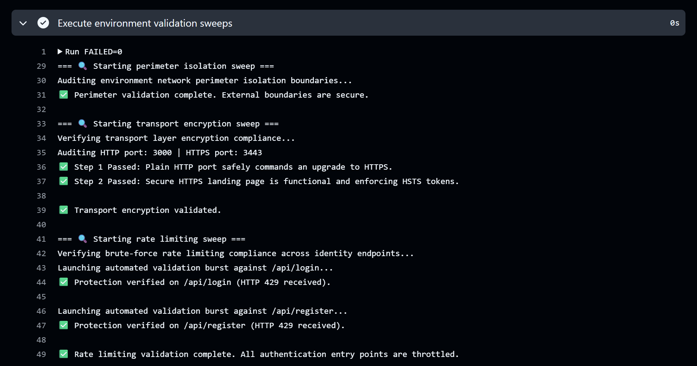

# 📓 Security Evolution Runbook: The Full-Stack AppSec Journey

This document serves as the chronological engineering ledger for this project. It details the step-by-step evolution of
an authentication portal as it progresses through development, static analysis, active exploitation and
runtime protection.

---

## 📍 Phase 1: The Functional Baseline

### The Architectural State
The initial milestone focused entirely on delivering a minimum viable product (MVP) authentication portal.
The application pairs a responsive React frontend with an Express.js backend API, backed by a
containerised PostgreSQL database.

### The Focus on Functional Success
Development was driven by standard product requirements: an intuitive interface, successful account onboarding and
accurate login verification.

-   **The Frontend:** A responsive UI that collects credentials and sends standard HTTP requests to the backend.
-   **The Backend:** Route handlers that extract user input directly from the request body to run database queries.

**The Engineering Reality:**
At this stage, the project is a functional success. It passes manual QA testing flawlessly: users can
successfully register an account and log in with their created credentials.

---

## 📍 Phase 2: Shifting Security Left

### The Strategy
To establish baseline visibility over code quality, an automated security gate was integrated into
the **GitHub Actions workflow** utilising **Semgrep**. This tool acts as an automated code reviewer, analysing
the structure of my source code on every push. Its purpose is to act as a preventative guardrail, ensuring any
future updates or feature branches are automatically checked for structural risks before they can be merged.

### The SAST Pipeline Results
Upon pushing the initial baseline code, the pipeline halted execution, reporting
**4 blocking findings** across the authentication routes.


```text
┌─────────────────┐
│ 4 Code Findings │
└─────────────────┘
    backend/server.js
   ❯❯❱ github.workflows.appsec-critical-sqli (CWE-89)
   ❯❯❱ github.workflows.appsec-high-unhashed-credential-storage (CWE-256)
```

-   **The Cause:** Registration and login routes fed unvalidated text inputs straight into `pool.query()` without
    data sanitisation or cryptographic hashing.

### Static Remediation & The Overfitting Discovery
To clear the blocking findings, I patched the vulnerabilities by implementing the following fixes:
1. **Parameterised Queries:** Swapped dynamic string construction for pre-compiled parameters (`$1, $2`),
   preventing user input from masquerading as executable SQL commands.
2. **Hashing:** Implemented asynchronous `bcrypt` password stretching with a cost factor of `10` rounds.

However, upon pushing the secure code, the SAST pipeline continued to fail, continuing to flag
the secure lines as vulnerabilities.

#### The Root Cause
The initial custom Semgrep rule relied on **Signature-Based Matching** (looking for strict text formatting patterns).
The rule engine failed to recognise the secure patch and threw a false positive.

#### The Rule Architecture Shift
To build a resilient security gate, the rule was refactored away from rigid text matches toward a
universal tracking model called **Dataflow Taint Tracking**.

Instead of policing how a developer formats their code, the security engine now operates like a digital dye test,
tracking the state of information as it flows through the system:

```text
                     ┌───► [ Hashing Function ] ───► (Dye Washed Away) ───► [ Safe Database Entry ]  (BUILD PASSES)
                     │
 [ Raw User Input ] ─┤
(Injected with Dye)  │
                     └───► [ Unsanitised Flow ] ───► (Dye Still Present) ─► [ Database Write Blocked ] (BUILD FAILS)
```

#### How the Automated Gate Evaluates Code Now:
1. **The Source:** Any input entering the application via an incoming web request is automatically flagged as
   tainted (dyed/untrusted).
2. **The Sanitiser:** If that untrusted information passes through an approved cryptographic hashing function,
   the system washes away the taint and marks the data as "safe".
3. **The Sink:** The system continuously guards the database. If any data attempts to update a user registry without
   passing through the sanitiser first, the build is blocked.

**The Result:** Refactoring to Taint Tracking permanently eliminated the false positives while establishing an
automated guardrail that prevents the exposure of unscrambled passwords if the data tier is breached.


---

## 📍 Phase 3: Defensive Emulation (The Kali Offensive)

### The Objective
To manually test the running application just like a real malicious actor would over the network. While my
previous security checks (SAST) looked at the code files line-by-line, this phase looks at how the application behaves
when it is turned on and plugged into the network.

### The Edge Routing Hurdle 
The application runs inside a containerised sandbox. The original frontend client code hardcoded backend data requests
to `http://localhost:5000`. While this works on a local machine, launching the application over a
VirtualBox network bridge or external internet connection causes the web client to return internal server errors.

### Edge Proxy Architecture Implementation
To expose the application safely to my Kali attacker machine, an industry-standard Nginx Reverse Proxy container layer
was introduced. The frontend code was refactored to use environment-relative routing paths (`/api/login`) and
the Nginx configuration handles edge routing abstraction:

```text
[ Internet User Browser ] ───► (Host Port 3000) ───► [ Nginx Server (frontend-ui) ]
                                                               │
                             ┌─────────────────────────────────┴─────────────────────────────────┐
                             ▼                                                                   ▼
                 Static Web Content Request                                          Data Transaction Route (/api/)
                 Served directly from static build                                   Proxied via Docker Internal Bridge Network
                                                                                     proxy_pass http://backend-api:5000;
```

By presenting both the UI and the API under the exact same hostname and port context, I eliminate
client-side CORS issues and isolate the Express backend server from direct public exposure.

### The Attack Sequence

#### Step 1: Scanning for Unlocked Doors (The Port Scan)
An aggressive network reconnaissance scan was executed using `Nmap` from the attacking Kali Linux VM map
active network listeners.

-   **The Analogy:** Approaching a building and checking every single door and window to see which ones are
    unlocked.
-   **What I found:** The scan showed that three doors are wide open: Port `3000` (the main web server),
    Port `5000` (the Express backend server), and Port `5432` (the database server).
-   **The Consequence:** While Port 3000 must be open so users can view the website, exposing ports 5000 and
    5432 bypasses the Nginx security perimeter entirely, allowing adversaries to interact with the backend API and
    database directly.

    ```text
    PORT     STATE SERVICE    VERSION
    3000/tcp open  http       nginx 1.25.5
    |_http-server-header: nginx/1.25.5
    |_http-title: frontend
    5000/tcp open  http       Node.js Express framework
    |_http-title: Error
    |_http-cors: HEAD GET POST PUT DELETE PATCH
    5432/tcp open  postgresql PostgreSQL DB
    ```

#### Step 2: Mapping Hidden Hallways (The Dirb Attack)
An automated sweep was executed using Dirb paired with a common directory wordlist to discover hidden endpoint pathways.

-   **The Analogy:** Entering a public building and systematically testing every single unmarked door,
    back staircase and service corridor to find restricted staff areas that the building operators forgot to lock.
-   **What we found:** Dirb successfully exposed a hidden diagnostic: `/health`
-   **The Consequence:**  By bypassing the public areas of the website, they can slip into internal utility corridors
    where they can scrape diagnostic metrics and gather information to plan a deeper attack.

#### Step 3: Sniffing Network Traffic (The Wireshark Attack)
I launched **Wireshark**, a standard network capture utility that records all data packets travelling through
the network. I monitored the traffic while entering test credentials into the portal.

-   **The Analogy:** Looking over someone's shoulder while they type out their password. With no barrier blocking
    your view, you can read every single character as it is entered.
-   **What I found:** Wireshark intercepted the network packet and instantly printed the raw login details in
    plaintext:
    ```json
    {"username": "user", "password": "password123"}
    ```
-   **The Consequence:** Because the current website uses unencrypted `http://`, passwords move
    across the network in plaintext. Anyone sharing the same network can steal user passwords everytime someone logs in.

#### The Takeaway:
Having defensive code but misconfigured infrastructure is like having a security shutters down on your storefront but
leaving the yard door unlocked. While the source code successfully neutralises application-layer exploits,
the infrastructure orchestration introduces fatal entry points, allowing attackers to target backend servers and
databases directly.

---

## 📍 Phase 4: Runtime Operational Validation

### The Strategy
Manually breaking into the application with Kali was an eye-opener: it demonstrated that solid code doesn't mean much if
the infrastructure around it isn't buttoned up. This phase is all about translating those hands-on discoveries into a
continuous, automated verification layer.

Instead of treating runtime security as a one-time audit or a checklist item, I wanted to build a dynamic safety net
right into the development loop. By integrating a Dynamic Application Security Testing (DAST) layer, the pipeline now
boots up the environment and actively inspects its own perimeters on every run, turning my manual attack notes into
automated guardrails.

### Designing Future-Proof Guardrails
Recall the issue with overfitting when the SAST rules were first designed. If the testing scripts were hardcoded to
look strictly for ports 5000 and 5432, or forced them to scan an exact address like http://localhost:3000,
the pipeline would eventually break down as the architecture scaled.

To build a resilient testing gate, I designed the security utilities to use a dynamic model that queries
the Docker Runtime Daemon:

```text
                               ┌───► [ Dynamic Port Inspecting ] ────► Scan for unauthorised host exposures (5000/5432)
                               │
[ Trigger DAST Pipeline Sweep ]┤
                               │
                               └───► [ Adaptive Endpoint Targeting ] ─► Target active Nginx public interface to test security headers
```

#### How the Automated Gate Evaluates Infrastructure:
1. **Dynamic Port Inspecting:** The suite inspects container port bindings at runtime. If a developer accidentally
   exposes a backend or database port directly to the host interface, the script automatically flags it.
2. **Adaptive Endpoint Targeting:** The transport encryption verification script queries Docker to isolate the
   exact external port bound to Nginx. It automatically targets this endpoint to verify that connection requests
   safely upgrade to HTTPS and return the correct security headers.
3. **Cumulative Log Gathering:** Individual scripts process security errors silently without
   throwing early exit crashes. This ensures all vulnerabilities that caused the pipeline to fail are shown.

### The DAST Pipeline Results
With the current vulnerabilities identified, the pipeline halted, throwing explicit alerts regarding configuration flaws
and unencrypted web traffic.


### ZAP Policy Tuning
As part of my DAST strategy, I also integrated OWASP ZAP into the pipeline.



Instead of blindly chasing every alert thrown by the automated scanner, I mapped the tool's findings directly against
the active boundaries of my system. By researching the specific vulnerability documentation behind each alert, I
evaluated which vulnerabilities posed an authentic threat to my code and infrastructure and separated the noise from
genuine exposure.

```text
                               ┌───► [ Irrelevant Noise ] ─────────► Static asset caching & hardware APIs that the code doesn't touch
                               │
[ Automated OWASP ZAP Engine ]─┤
                               │
                               └───► [ Relevant Security Gaps ] ───► Missing security headers that expose users to exploits
```

I built a custom ZAP rules configuration to silence alerts that had no real attack surface, like static file caching,
hardware APIs the code never calls and security rules meant for third-party websites. This kept the pipeline clean and
allowed me to focus engineering effort strictly on the gaps that put the environment at risk.

My research singled out three specific vulnerabilities that directly exposed my frontend to
legitimate attacks:
```text
Missing Anti-clickjacking Header [10020]
X-Content-Type-Options Header Missing [10021]
Content Security Policy (CSP) Header Not Set [10038]
```

To remediate these vulnerabilities, I injected the necessary security headers in both the backend server and the
Nginx configuration file. Enforcing these directives through the Nginx reverse proxy and the backend server ensures
the client browser is strictly mandated to block UI-overlay hijacking, stop running files that don't match their
declared format and block unapproved scripts from execution.



### Infrastructure Remediation
#### Reducing the Attack Surface
To shrink the network attack surface, I removed public port bindings for the API (`5000`) and database (`5432`) from
the root Docker configuration file. After this was done, the DAST pipeline indicated that the network permimeter was
isolated.

However, during local integration verification, an unexpected security paradox appeared: running an `Nmap` scan from a
Kali Linux VM hosted within VirtualBox flagged port `5432/tcp` (PostgreSQL) as open.

```text
PORT     STATE    SERVICE    VERSION
3000/tcp open     http       nginx 1.25.5
|_http-server-header: nginx/1.25.5
|_http-title: frontend
5000/tcp filtered upnp
5432/tcp open     postgresql PostgreSQL DB
```

This suggested that there was a dangerous false negative inside my automated DAST suite. The script reported
the boundary was secure yet an attacking OS could see the data layer.

This friction forced a critical moment of self-education regarding network isolation and the necessity of
thorough multi-layered validation:
1. **The Investigation:** To prove the threat model, I introduced an external validation layer by scanning the host from
   a completely separate physical machine on the local network. This external scan correctly reported the port as
   filtered.

    ```text
    PORT     STATE    SERVICE    VERSION
    3000/tcp open     tcpwrapped
    5000/tcp filtered upnp
    5432/tcp filtered postgresql
    ```

2. **The Discovery:** Researching how hypervisors interact at the system level revealed a localised routing overlap.
   When Docker establishes a virtual bridge network, it lives natively inside the host operating system kernel. Since
   VirtualBox binds its host-only or bridged adapters to that same kernel, the host machine quietly routes traffic
   internally between the Kali VM and the local Docker interface, bypassing external firewall realities.
3. **The Engineering Takeaway:** The DAST pipeline script was correct in its assertion that the backend ports were
   isolated from external network interfaces and the apparent exposure was simply an artefact of the hypervisor's
   internal routing. However, this experience taught me the importance of network vantage points and the requirement for
   rigorous validation.

#### Protecting against denial-of-service (DoS) attacks
The automated DAST scan pointed out that the authentication endpoints had no restriction on request frequency.
This meant an attacker could easily run an automated password-guessing script
(a brute-force attack) or spam the system until the application crashed entirely.

To fix this, I updated the Nginx configuration to enforce a traffic throttle. By establishing dedicated memory zones,
Nginx tracks request frequencies mapped directly to the client's IP address.

I applied a strict rule to the authentication routes: users are allowed a baseline of 5 requests per second,
with a small "burst" buffer of 10 requests to accommodate for legitimate, rapid user actions and internet realities
(like a browser sending multiple requests at the exact same millisecond). If an attacker tries to bypass these rules and
floods the authentication endpoints, Nginx steps in immediately, cuts off the traffic and returns a
clean `HTTP 429 Too Many Requests` error before the spam can slow down the server.

#### Implementing transport-level encryption
The automated DAST scan identified that the frontend gateway permitted unencrypted web traffic, exposing user passwords
to data interception over public networks (`CWE-319`).

To resolve this exposure, I refactored the infrastructure across three key layers:
-   **Staging Certificates:** I updated the frontend Dockerfile to generate a self-signed security certificate directly
    inside the container during the build phase.
-   **Split Gateway Model:** I re-configured Nginx to have dual server blocks. Port `80` acts as a dedicated routing gate
    that forces a global upgrade to HTTPS. Meanwhile, port `443` handles the secure connection, safely unwrapping
    the encrypted traffic and injecting an automatic HTTPS upgrade policy (`Strict-Transport-Security`) to inform
    the browser that the host should only be accessed using HTTPS.
-   **Dual Ingress:** I updated the root Docker configuration file to expose both standard web traffic and
    secure pathways (`3000:80` and `3443:443`).

Since the system now exposes two host ports, the transport encryption verification script was also refactored to prevent
false alarms. It now audits each entry point independently:
-   **Step 1 (Entrance Check):** Probe port `3000` to ensure the server immediately forces a secure upgrade and
    links directly to a `https://` web address.
-   **Step 2 (Landing Zone Check):** Probe port `3443` to verify the secure landing zone responds cleanly (`CWE-755`)
-   and actively delivers the HTTPS upgrade policy.

Following remediation, a network packet analysis via Wireshark confirmed that all application-layer payloads were
entirely encrypted into unreadable ciphertext.



## Project Retrospective
Anyone faintly interested in cybersecurity can skim through standard literature and memorise that
SAST tools struggle with structural nuances such as access control issues and insecure use of cryptography while DAST
tools compensate by detecting live authentication flaws and server misconfigurations. However, learning theory is
entirely different from manually breaking into your own environment and attempting to patch the cascade of
vulnerabilities that follow one after the other.

By engineering this project from a fragile baseline to a fully automated pipeline, I navigated the engineering realities
that theory does not teach. I experienced exactly what difficulties engineers face when designing static safeguards
(even when future features are planned out), how firewall realities could be bypassed from choosing a poor vantage
point for testing and how baseline scanners can fill a pipeline with irrelevant warnings.

Foundational knowledge provides the blueprint but building reveals the cracks. Moving this project from a fragile
baseline to an automated lifecycle forced me to confront real system edge cases firsthand. Successfully navigating
hypervisor quirks, optimising scanner rules and hardening network perimeters reinforced that building a secure system is
a continuous cycle of breaking, learning and adapting to a landscape that never stops shifting.