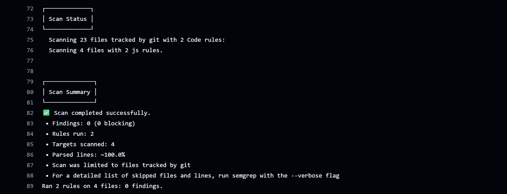
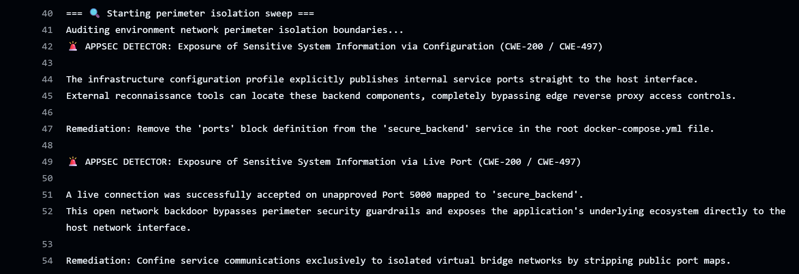

# 📓 Security Evolution Runbook: The Full-Stack AppSec Journey

This document serves as the chronological engineering ledger for this project. It details the step-by-step evolution of
an authentication portal as it progresses through development, static analysis, active exploitation and
runtime protection.

---

## 📍 Phase 1: The Functional Baseline

### The Architectural State
The initial milestone focused entirely on delivering a minimum viable product (MVP) authentication portal.
The application pairs a responsive React frontend with an Express.js backend API, backed by a
containerised PostgreSQL database.

### The Focus on Functional Success
Development was driven by standard product requirements: an intuitive interface, successful account onboarding and
accurate login verification.

-   **The Frontend:** A responsive UI that collects credentials and sends standard HTTP requests to the backend.
-   **The Backend:** Route handlers that extract user input directly from the request body to run database queries.

**The Engineering Reality:**
At this stage, the project is a functional success. It passes manual QA testing flawlessly: users can
successfully register an account and log in with their created credentials.

---

## 📍 Phase 2: Shifting Security Left

### The Strategy
To establish baseline visibility over code quality, an automated security gate was integrated into
the **GitHub Actions workflow** utilising **Semgrep**. This tool acts as an automated code reviewer, analysing
the structure of my source code on every push. Its purpose is to act as a preventative guardrail, ensuring any
future updates or feature branches are automatically checked for structural risks before they can be merged.

### The SAST Pipeline Results
Upon pushing the initial baseline code, the pipeline halted execution, reporting
**4 blocking findings** across the authentication routes.


```text
┌─────────────────┐
│ 4 Code Findings │
└─────────────────┘
    backend/server.js
   ❯❯❱ github.workflows.appsec-critical-sqli (CWE-89)
   ❯❯❱ github.workflows.appsec-high-unhashed-credential-storage (CWE-256)
```

-   **The Cause:** Registration and login routes fed unvalidated text inputs straight into `pool.query()` without
    data sanitisation or cryptographic hashing.

### Static Remediation & The Overfitting Discovery
To clear the blocking findings, I patched the vulnerabilities by implementing the following fixes:
1. **Parameterised Queries:** Swapped dynamic string construction for pre-compiled parameters (`$1, $2`),
   preventing user input from masquerading as executable SQL commands.
2. **Hashing:** Implemented asynchronous `bcrypt` password stretching with a cost factor of `10` rounds.

However, upon pushing the secure code, the SAST pipeline continued to fail, continuing to flag
the secure lines as vulnerabilities.

#### The Root Cause
The initial custom Semgrep rule relied on **Signature-Based Matching** (looking for strict text formatting patterns).
The rule engine failed to recognise the secure patch and threw a false positive.

#### The Rule Architecture Shift
To build a resilient security gate, the rule was refactored away from rigid text matches toward a
universal tracking model called **Dataflow Taint Tracking**.

Instead of policing how a developer formats their code, the security engine now operates like a digital dye test,
tracking the state of information as it flows through the system:

```text
                     ┌───► [ Hashing Function ] ───► (Dye Washed Away) ───► [ Safe Database Entry ]  (BUILD PASSES)
                     │
 [ Raw User Input ] ─┤
(Injected with Dye)  │
                     └───► [ Unsanitised Flow ] ───► (Dye Still Present) ─► [ Database Write Blocked ] (BUILD FAILS)
```

#### How the Automated Gate Evaluates Code Now:
1. **The Source:** Any input entering the application via an incoming web request is automatically flagged as
   tainted (dyed/untrusted).
2. **The Sanitiser:** If that untrusted information passes through an approved cryptographic hashing function,
   the system washes away the taint and marks the data as "safe".
3. **The Sink:** The system continuously guards the database. If any data attempts to update a user registry without
   passing through the sanitiser first, the build is blocked.

**The Result:** Refactoring to Taint Tracking permanently eliminated the false positives while establishing an
automated guardrail that prevents the exposure of unscrambled passwords if the data tier is breached.



---

## 📍 Phase 3: Defensive Emulation (The Kali Offensive)

### The Objective
To manually test the running application just like a real malicious actor would over the network. While my
previous security checks (SAST) looked at the code files line-by-line, this phase looks at how the application behaves
when it is turned on and plugged into the network.

### The Edge Routing Hurdle 
The application runs inside a containerised sandbox. The original frontend client code hardcoded backend data requests
to http://localhost:5000. While this works on a local machine, launching the application over a
VirtualBox network bridge or external internet connection causes the web client to return internal server errors.

### Edge Proxy Architecture Implementation
To expose the application safely to my Kali attacker machine, an industry-standard Nginx Reverse Proxy container layer
was introduced. The frontend code was refactored to use environment-relative routing paths (`/api/login`) and
the Nginx configuration handles edge routing abstraction:

```text
[ Internet User Browser ] ───► (Host Port 3000) ───► [ Nginx Server (frontend-ui) ]
                                                               │
                             ┌─────────────────────────────────┴─────────────────────────────────┐
                             ▼                                                                   ▼
                 Static Web Content Request                                          Data Transaction Route (`/api/`)
                 Served directly from static build                                   Proxied via Docker Internal Bridge Network
                                                                                     proxy_pass http://backend-api:5000;
```

By presenting both the UI and the API under the exact same hostname and port context, we eliminate
client-side CORS issues and isolate the Express backend server from direct public exposure.

### The Attack Sequence

#### Step 1: Scanning for Unlocked Doors (The Port Scan)
An aggressive network reconnaissance scan was executed using `Nmap` from the attacking Kali Linux VM map
active network listeners.

-   **The Analogy:** Approaching a building and checking every single door and window to see which ones are
    unlocked.
-   **What I found:** The scan showed that three doors are wide open: Port `3000` (our main web server),
    Port `5000` (our Express backend server), and Port `5432` (our database server).
-   **The Consequence:** While Port 3000 must be open so users can view the website, exposing ports 5000 and
    5432 bypasses the Nginx security perimeter entirely, allowing adversaries to interact with the backend API and
    database directly.

    ```text
    PORT     STATE SERVICE    VERSION
    3000/tcp open  http       nginx 1.25.5
    |_http-server-header: nginx/1.25.5
    |_http-title: frontend
    5000/tcp open  http       Node.js Express framework
    |_http-title: Error
    |_http-cors: HEAD GET POST PUT DELETE PATCH
    5432/tcp open  postgresql PostgreSQL DB
    ```

#### Step 2: Mapping Hidden Hallways (The Dirb Attack)
An automated sweep was executed using Dirb paired with a common directory wordlist to discover hidden endpoint pathways.

-   **The Analogy:** Entering a public building and systematically testing every single unmarked door,
    back staircase and service corridor to find restricted staff areas that the building operators forgot to lock.
-   **What we found:** Dirb successfully exposed a hidden diagnostic: `/health`
-   **The Consequence:**  By bypassing the public areas of the website, they can slip into internal utility corridors
    where they can scrape diagnostic metrics and gather information to plan a deeper attack.

#### Step 3: Sniffing Network Traffic (The Wireshark Attack)
I launched **Wireshark**, a standard network capture utility that records all data packets travelling through
the network. I monitored the traffic while entering test credentials into the portal.

-   **The Analogy:** Looking over someone's shoulder while they type out their password. With no barrier blocking
    your view, you can read every single character as it is entered.
-   **What I found:** Wireshark intercepted the network packet and instantly printed the raw login details in
    plaintext:
    ```json
    {"username": "user", "password": "password123"}
    ```
-   **The Consequence:** Because the current website uses unencrypted `http://`, passwords move
    across the network in plaintext. Anyone sharing the same network can steal user passwords everytime someone logs in.

#### The Takeaway:
Having defensive code but misconfigured infrastructure is like having a security shutters down on your storefront but
leaving the yard door unlocked. While the source code successfully neutralises application-layer exploits,
the infrastructure orchestration introduces fatal entry points, allowing attackers to target backend servers and
databases directly.

---

## 📍 Phase 4: Runtime Operational Validation

### The Strategy

Phase 3 used an offensive attacker mindset to discover exposed network backdoors. Phase 4 builds those discoveries into
my continuous engineering defences.

To catch environment flaws early, I integrated an automated DAST (Dynamic Application Security Testing) layer into
the workflow execution stack. Rather than leaving network-layer vulnerabilities unmonitored until a
formal penetration test or manual audit occurs, this pipeline builds a permanent programmatic safety net.
It automatically launches the environment, waits for a healthy state and inspects the system boundaries before
any code can deploy.

### Designing Future-Proof Guardrails
Recall the issue with overfitting when the SAST rules were first designed. If the testing scripts were hardcoded to
look strictly for ports 5000 and 5432, or forced them to scan an exact address like http://localhost:3000,
the pipeline would eventually break down as our architecture scaled.

To build a resilient testing gate, I designed the security utilities to use a dynamic, declarative model that queries
the Docker Runtime Daemon:

```text
                               ┌───► [ Query Image Metadata ] ───► Auto-discover all exposed ports ───► Test host loopback
                               │
[ Trigger DAST Pipeline Sweep ]┤
                               │
                               └───► [ Query Live Gateway ] ────► Resolve bound Nginx port ─────────► Test encryption headers
```

#### How the Automated Gate Evaluates Infrastructure:
1. **Dynamic Port Harvesting:** The suite inspects container metadata at runtime. If a developer accidentally exposes
   a backend or database port to the host interface, the script flags it automatically.
2. **Adaptive Endpoint Targeting:** The transport script queries Docker to identify exactly which external port
   the Nginx front door is listening on. It automatically targets its connection checks whether it is evaluating
   HTTP staging environments or active HTTPS encryption rules.
3. **Cumulative Log Gathering:** Individual scripts process security errors silently without
   throwing early exit crashes. This ensures all vulnerabilities that caused the pipeline to fail are shown.

### The DAST Pipeline Results
With the current vulnerabilities identified, the pipeline halted, throwing explicit alerts regarding configuration flaws
and unencrypted web traffic.



### Cascading Warning Loops & Policy Tuning
Plugging OWASP ZAP into a CI/CD pipeline reveals a major security engineering challenge:
cascading vulnerability warnings. Default security scanners apply rigid, generic rulesets. If an engineer tries to
patch every warning blindly, they get stuck in an endless loop of fixing one alert only to trigger secondary ones.
Managing this noise requires clear scoping and early policy triage.

-   The Ingress Disconnect: Our initial raw ZAP baseline scan failed the build by flagging missing headers across the app (like Rule 10038 for CSP, 10020 for Anti-clickjacking, and 10021 for X-Content-Type-Options). We reacted by adding security middleware to our Express backend (server.js).
-   The Architectural Reality: The next pipeline run failed anyway. This exposed a major gap: while our Express code covered dynamic paths (like /api/login), our static frontend assets (favicon.svg, robots.txt, CSS, and JS files) are served directly at the front door by Nginx. They completely bypassed our Node runtime, arriving at the scanner unprotected.
-   Scanner Over-Sensitivity vs. Production Realities: When we duplicated the essential security headers into nginx.conf using the always directive, ZAP instantly triggered a massive cascade of new warnings. It flagged rules like 10055 (CSP Fallback) because our policy allowed 'unsafe-inline', and 90004 (COEP Missing). However, modern frameworks like React require inline style injections to handle compilation chunks mid-flight. Forcing a developer to re-engineer standard frontend bundling simply to satisfy an inflexible scanner ruleset wastes valuable engineering cycles.
-   Triage and Policy Scoping: Real-world vulnerability management means separating critical threats from noise. Low-priority environmental alerts—such as cache-control directives on public assets (10015, 10049), missing permissions policies on a login loop (10063), or informational framework tags (10109)—do not represent active compromise vectors.
-   Strategic Mitigation: We accepted these risks by converting our ZAP configuration into a tuned baseline profile. We utilized ZAP's security-as-code ledger (zap-rules.conf) to explicitly change these specific rules to IGNORE. This keeps our pipeline gate green while documenting our intentional, justified architectural trade-offs directly in our Git repository history.

### Infrastructure Remediation
#### Reducing the Attack Surface
To shrink the network attack surface, I removed public port bindings for the API (`5000`) and database (`5432`) from
the root Docker configuration file. After this was done, the DAST pipeline indicated that the network permimeter was
isolated.

However, during local integration verification, an unexpected security paradox appeared: running an `Nmap` scan from a
Kali Linux VM hosted within VirtualBox flagged port `5432/tcp` (PostgreSQL) as open.

```text
PORT     STATE    SERVICE    VERSION
3000/tcp open     http       nginx 1.25.5
|_http-server-header: nginx/1.25.5
|_http-title: frontend
5000/tcp filtered upnp
5432/tcp open     postgresql PostgreSQL DB
```

This suggested that there was a dangerous false negative inside my automated DAST suite. The script reported
the boundary was secure, yet an attacking OS could see the data layer.

This friction forced a critical moment of self-education regarding network isolation and the necessity of
thorough multi-layered validation:
1. **The Investigation:** To prove the threat model, I introduced an external validation layer by scanning the host from
   a completely separate physical machine on the local network. This external scan correctly reported the port as
   filtered.

    ```text
    PORT     STATE    SERVICE    VERSION
    3000/tcp open     tcpwrapped
    5000/tcp filtered upnp
    5432/tcp filtered postgresql
    ```

2. **The Discovery:** This taught me how virtualisation platforms interact at the kernel layer. When Docker establishes
   a virtual bridge network, it lives natively on the host operating system kernel. Since VirtualBox also binds its
   host-only or bridged adapters to that same kernel, the host machine quietly routes traffic internally between
   the local VM and the local Docker network, bypassing external firewall realities.
3. **The Engineering Takeaway:** The DAST pipeline script was operating with accuracy for its target deployment context.
   However, relying blindly on a single testing vantage point is dangerous. True security engineering requires
   verifying results outside of local hypervisor bubbles before writing off a validation failure.

#### Protecting against denial-of-service (DoS) attacks
The automated DAST scan pointed out that the `/api/login` and `/api/register` had no restriction on request frequency.
This meant an attacker could easily run an automated password-guessing script
(a brute-force attack) or spam the system until the application crashed entirely.

To fix this, I updated the Nginx reverse proxy configuration to include a traffic throttle. By creating a
shared memory area, Nginx now tracks incoming request frequencies based on
the visitor's IP address.

I applied a strict rule to the authentication routes: users are allowed a steady baseline of 5 requests per second,
with a small "burst" buffer of 10 requests to handle normal, fast page clicks and internet realities
(like a browser sending multiple requests at the exact same millisecond). If a script tries to bypass these rules and
floods the authentication endpoints, Nginx steps in immediately, cuts off the traffic and returns a
clean `HTTP 429 Too Many Requests` error before the spam can ever touch or slow down the backend server.

#### Implementing transport-level encryption
The final automated security sweep flagged a severe configuration issue: the front-door gateway allowed
unencrypted web traffic and completely lacked a Strict-Transport-Security (HSTS) header. This exposed
user authentication sessions directly to network data interception attacks (CWE-319).

To fix this, we updated three core areas:
-   **Staging Certificates:** I updated the frontend Dockerfile to generate a temporary security certificate directly
    inside the container during the build phase.
-   **Split Gateway Model:** I divided nginx.conf into two separate blocks. Port 80 serves no data and instantly
    redirects users to HTTPS (HTTP 301). Port 443 terminates the secure connection and injects the HSTS header to
    block future unencrypted attempts.
-   **Dual Ingress:** I updated the root Docker configuration file to expose both standard web traffic and
    secure pathways (3000:80 and 3443:443).

Since the system now exposes two host ports, the automated test script was refactored to prevent false alarms.
It now audits each entry point independently:
-   **Step 1 (Entrance Check):** Hits port 3000 to ensure the server immediately forces a secure upgrade and
    links directly to a https:// web address.
-   **Step 2 (Landing Zone Check):** Hits port 3443 to verify the secure page responds cleanly without crashing
    (CWE-755) and actively delivers the HSTS safety token. 

This decoupled architecture allows the deployment pipeline to pass cleanly while providing clear troubleshooting logs
if the port configurations ever drift.

Testing with Wireshark indicated packets were successfully encrypted.

## Reflection
To be added.