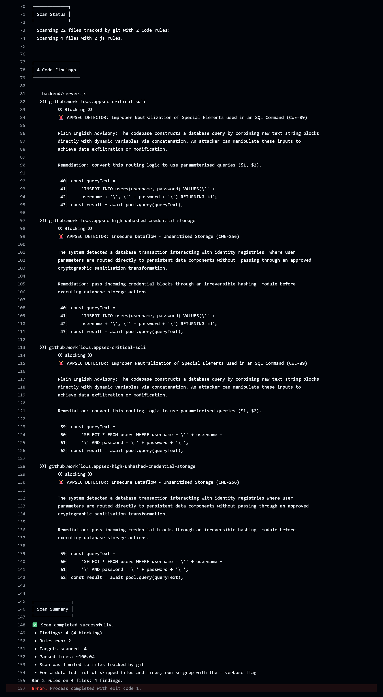

# 📓 Security Evolution Runbook: The Full-Stack AppSec Journey

This document serves as the chronological engineering ledger for this project. It details the step-by-step evolution of
an authentication portal as it progresses through development, static analysis, active exploitation and
eventual remediation.

---

## 📍 Phase 1: The Functional Baseline

### 1. The Architectural State
The initial milestone focused entirely on building a working full-stack authentication portal. The application pairs
a responsive React frontend with an Express.js backend API, backed by a containerised PostgreSQL database.

### 2. The Focus on Functional Success
Development was driven by standard product requirements: an intuitive interface, successful account onboarding and
accurate login verification.

*   **The Frontend:** A polished login UI that handles client-side form states and securely dispatches HTTP requests.
*   **The Backend:** Direct route handlers that extract user-provided credentials from the request body to execute immediate database lookups and storage.

**The Engineering Reality:**
At this stage, the project is a functional success. It passes standard manual testing flawlessly: users can
successfully register an account and log in with their created credentials.

---

## 📍 Phase 2: Shifting Security Left

### 1. The Strategy
To establish baseline visibility over code quality, an automated security gate was integrated into
the **GitHub Actions workflow** utilising **Semgrep**. This tool acts as an automated code reviewer, analysing
the structure of our source code on every push. Its purpose is to act as a preventative guardrail, ensuring any
future updates or feature branches are automatically checked for structural risks before they can be merged.

### 2. The Pipeline Results
Upon pushing the initial baseline code, the pipeline instantly halted execution, reporting
**4 blocking findings** across our active authentication routes.



```text
┌─────────────────┐
│ 4 Code Findings │
└─────────────────┘
    backend/server.js
   ❯❯❱ github.workflows.appsec-critical-sqli (CWE-89)
   ❯❯❱ github.workflows.appsec-high-unhashed-credential-storage (CWE-256)
```

**What this output means in plain English:**
- Semgrep identified that lines `40-43` (registration) and lines `59-62` (login) were feeding unvalidated
  text inputs straight into the database query engine (`pool.query`).
- Because the data flowing to the `users` table didn't pass through a hashing function, both rules fired simultaneously
  on both routes.

### 3. Static Remediation & The Overfitting Discovery
To clear the blocking findings, the backend code was structurally hardened by replacing raw string concatenation with
native node-postgres parameterised array bindings (`$1, $2`) and implementing asynchronous `bcrypt` password stretching
with a cost factor of `10` rounds.

However, upon pushing the secure code, the SAST pipeline continued to fail, continuing to flag
the secure lines as vulnerabilities.

#### The Root Cause
An audit of the custom security ruleset revealed **Signature-Based Overfitting**. Our original rule that checked for
credentials being hashed looked strictly for a specific text formatting style. Since our patch isolated the data
from the SQL command string, the pattern-matcher failed to understand the code and threw a false positive.

#### The Rule Architecture Shift
To build a resilient security gate, the rule was refactored away from checking rigid text styles toward a universal tracking model called **Dataflow Taint Tracking**.

Instead of policing how a developer formats their code, the security engine now operates like a digital dye test,
tracking the state of information as it flows through the system:

```text
                  ┌───► [ Hashing Function ] ───► (Cleaned & Approved) ───► [ Safe Database Query ] (ALLOW)
                  │
[ Raw User Input ]┤
 (Untrusted Data) │
                  └───► [ Raw/Direct Path ] ────► (Unhashed Input) ────► [ Identity Sink Block ]  (BLOCK BUILD)

```

#### How the Automated Gate Evaluates Code Now:
1. **The Source:** Any information entering the application via an incoming web request is automatically flagged as "untrusted."
2. **The Sanitiser:** If that untrusted information passes through an approved cryptographic hashing function, the system washes away the flag and marks the data as "safe."
3. **The Sink:** The system continuously guards the database. If any data attempts to update a user registry without passing through the sanitizer first, the build is blocked.

Because our updated logic properly hashes passwords, the data engine clears the pipeline instantly. This eliminated
the false positives permanently while ensuring future code additions remain perfectly secure.

---

## 📍 Phase 3: Defensive Emulation (The Kali Offensive)

### 1. The Objective
To map and test the infrastructure attack surface of our secure application layer containerisation over
the VirtualBox network interface.

### 2. The Edge Routing Hurdle 
The application runs inside a containerised sandbox. The original frontend client code hardcoded backend data requests
to http://localhost:5000. While this works on a local machine, launching the application over a
VirtualBox network bridge or external internet connection causes client web browsers to crash with
connection loopback failures.

### 3. Edge Proxy Architecture Implementation
To expose the application safely to our Kali attacker machine, an industry-standard Nginx Reverse Proxy container layer
was introduced. The frontend code was refactored to use environment-relative routing paths (/api/login) and
the Nginx configuration handles edge routing abstraction:

```text
[ Internet User Browser ] ───► (Host Port 3000) ───► [ Nginx Server (frontend-ui) ]
                                                               │
                             ┌─────────────────────────────────┴─────────────────────────────────┐
                             ▼                                                                   ▼
                 Static Web Content Request                                          Data Transaction Route (`/api/`)
                 Served directly from static build                                   Proxied via Docker Internal Bridge Network
                                                                                     `proxy_pass http://backend-api:5000;`

```

By presenting both the UI and the API under the exact same hostname and port context, we eliminate
client-side CORS issues and isolate the Express backend server from direct public exposure.

### 2. The Attack Sequence
To be added.

### 3. The Exploit Confirmation
To be added.

---

## 📍 Phase 4: Runtime Operational Validation

To be added.